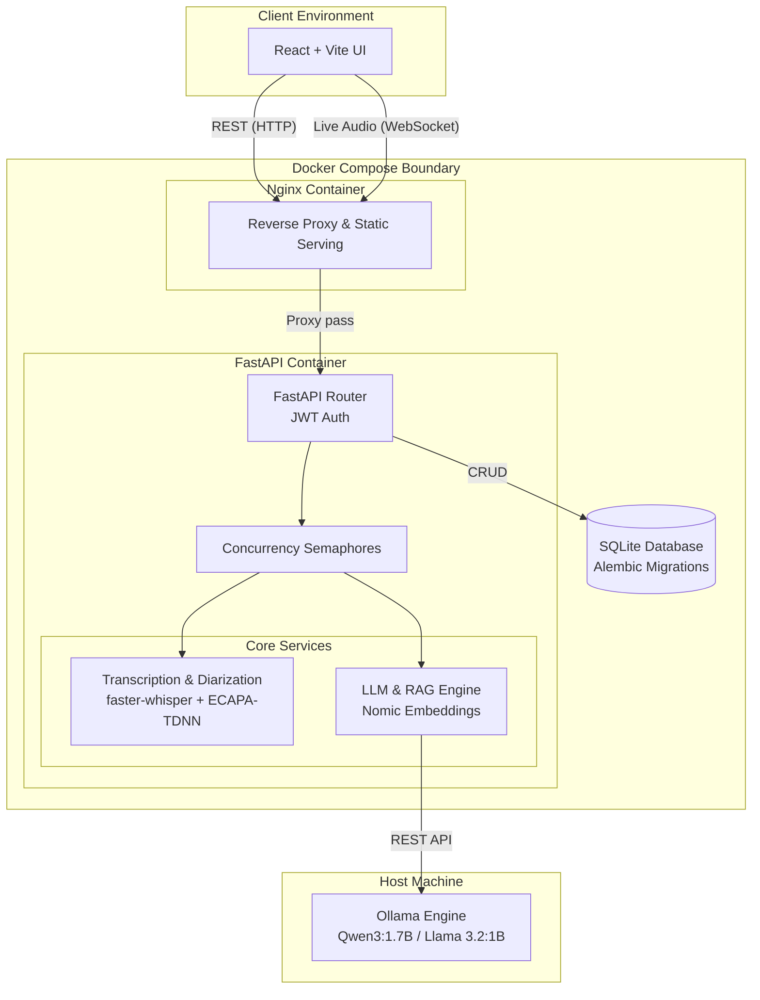

# BriefAI — Real-Time Meeting Transcription & Multilingual Summarization Platform

> **Status:** 🚀 Feature-Complete — All core stages (1-10) implemented, fully isolated, and tested.

BriefAI converts live speech or pasted meeting notes into structured summaries, translations, action items, academic notes, decisions logs, and custom-defined outputs. It includes a unified Workspace, a "Ask BriefAI" RAG-powered chat, a Custom Template Builder, and Speaker Diarization — all running locally via open-weight LLMs, strictly isolated per user with JWT authentication.

> 📹 **Watch the demo:** [BriefAI — full walkthrough (YouTube)](https://youtu.be/Cc3RfS2yeEk)

---

## Hardware Recommendations & Performance

BriefAI is designed to run completely locally, meaning transcription and LLM inference happen on your machine:
- **GPU (Recommended):** A dedicated graphics card with at least 6 GB of VRAM (e.g. Nvidia RTX 3060/4060 series, or Apple Silicon Mac M1/M2/M3 with unified memory) is highly recommended. This delivers sub-second to single-digit-second latencies (30–60+ tokens/sec) for a real-time experience.
- **CPU Fallback:** If no dedicated GPU is found, Ollama and Whisper will run on your CPU. While fully functional, latencies can be significantly higher (e.g., 25–45 seconds per LLM request depending on your CPU, which translates to 8–15 tokens/sec).
- **Perceived Latency Mitigation:** To offset CPU latencies, all LLM-based API routes support chunk-by-chunk token streaming (`stream=True`). The frontend can read and display progressive tokens in real time as they are generated by Ollama.

---

## Quick Start (Docker - Recommended)

The easiest way to stand up the BriefAI web architecture is using Docker Compose. This instantly provisions the frontend, backend, and database without needing Node.js or Python environments.

> [!TIP]
> **End-to-End Verified:** The Docker configuration has been fully tested and verified end-to-end. Both frontend (Nginx) and backend (FastAPI/Alembic) containers build and communicate seamlessly in isolated environments.

> [!CAUTION]
> **AI Models Disclaimer:** While Docker brings the web app up instantly, the AI models (Ollama Qwen/Llama and Whisper/Diarization models) must still be pulled manually and downloaded on first run. Without GPU passthrough (which is complex across OS boundaries), the backend defaults to CPU-only inference. Expect significant latency (often 60s+) for transcription and summarization tasks.

1. Install [Docker Desktop](https://www.docker.com/products/docker-desktop/) (or Docker + docker-compose on Linux).
2. Install [Ollama](https://ollama.com/) natively on your host machine.
3. Pull the required models in Ollama:
   ```bash
   ollama pull qwen3:1.7b
   ollama pull llama3.2:1b
   ```
4. Start the BriefAI application:
   ```bash
   docker-compose up --build -d
   ```
5. Navigate to `http://localhost` in your browser.

---

## Benchmarking Results & Local LLM Insights (Stage 5)

We implemented an automated benchmarking module to compare the speed, throughput, context loading, memory utilization, and quality of **Qwen3-1.7B** (`qwen3:1.7b`) vs. **Llama 3.2-1B** (`llama3.2:1b`) on identical meeting transcripts.

### Head-to-Head Benchmark Profile

The following head-to-head comparison was evaluated on identical inputs:

| Model | Workload | Status | TTFT (ms) | Latency (s) | Throughput (tok/s) | Context Speed (tok/s) | Memory RSS (MB) | Peak RAM (MB) | Quality (1-5) |
|---|---|---|---|---|---|---|---|---|---|
| `qwen3:1.7b` | Small | Empty (Token Cap) | 14321.5 | 14.32 | 11.7 | 1515.6 | 3428.3 | 3448.9 | N/A |
| `llama3.2:1b` | Small | Success | 1603.5 | 10.63 | 11.6 | 1556.8 | 3467.0 | 3467.0 | 5.0 |
| `qwen3:1.7b` | Medium | Empty (Token Cap) | 14851.9 | 14.85 | 11.2 | 3983.2 | 3477.0 | 3477.0 | N/A |
| `llama3.2:1b` | Medium | Success | 1657.1 | 15.49 | 11.1 | 3649.1 | 3508.8 | 3508.8 | 4.5 |
| `qwen3:1.7b` | Large | Success | 29870.7 | 40.39 | 9.0 | 7793.0 | 3584.7 | 3584.7 | 3.5 |
| `llama3.2:1b` | Large | Success | 1411.8 | 25.64 | 10.2 | 8053.1 | 3492.6 | 3492.7 | 5.0 |

*Metrics average of 3 trials after initial warmup. RSS/Peak memory tracks aggregate host RAM of active `llama-server.exe` processes.*

### Critical Insight: Reasoning Token Budget Constraint

A significant finding during Stage 5 benchmarking was the **Reasoning Token Cap Failure Mode** in `qwen3:1.7b` (which behaves as a distilled reasoning model):
- **The Issue:** Reasoning models allocate a significant portion of their token budget (typically 150–200 tokens) to the inner `<thinking>` loop before producing the first response token. When enforcing a token generation limit (`num_predict=150`), the model exhausts its entire budget on thinking and returns a silent empty text response to the user.
- **The Solution (Safeguard):** In the production route (`/api/v1/summarization/process`), we implemented a safeguard:
  1. The backend automatically detects empty/whitespace text returned from Qwen3.
  2. For non-streaming requests, it triggers an immediate retry with an expanded budget (`num_predict=1024`). If it still returns empty, it fails loudly.
  3. For streaming requests, it monitors the generated tokens and appends a loud error notification block in the stream if reasoning budget exhaustion is detected, ensuring the failure mode is never silent.

---

## Token-Free Diarization (Known Limitations)

BriefAI uses a fully open-source, token-free diarization pipeline (SpeechBrain ECAPA-TDNN + Scikit-Learn AgglomerativeClustering) instead of gated models like Pyannote. While this allows out-of-the-box usage without HuggingFace authentication, it comes with strict, scientifically-understood accuracy tradeoffs:

> [!WARNING]
> **Limitation 1: Overlapping Speech:** The custom clustering approach assigns a single speaker label to each discrete Whisper segment. It cannot detect when two people talk at exactly the same time. If two speakers overlap, the segment is assigned to whichever speaker's voice fingerprint (embedding) is dominant.
> 
> **Limitation 2: Straddling Segments (Quick Turn-Taking):** Even without simultaneous overlap, rapid turn-taking can cause issues. If Whisper generates a single text segment that straddles the boundary between two speakers (e.g., contains the end of Speaker 1's sentence and the beginning of Speaker 2's sentence), the resulting audio chunk contains both voices. This produces a "mixed" embedding, which the clustering algorithm will often identify as a hallucinated third speaker.
> 
> **Limitation 3: Short Interjections:** The ECAPA-TDNN embedding model requires a sufficient length of audio (typically 1.5+ seconds) to generate a reliable voice fingerprint. Very short interjections ("yeah", "mhmm") may be misclassified because there isn't enough acoustic data to identify the speaker.

---

## Retrieval-Augmented Generation (RAG) & Grounding Guard

BriefAI uses a minimalist, local vector search approach (Nomic embeddings + exact cosine similarity in Python/SQLite) to provide "Ask BriefAI" chat functionality grounded strictly in your meeting history.

> [!WARNING]
> **Grounding Threshold Tuning:** The system enforces a strict similarity threshold to prevent the LLM from hallucinating answers when no relevant meeting chunks exist. This threshold was tuned via best-effort empirical testing on a limited set of queries. It may not perfectly handle every edge case (e.g., an unrelated query that happens to share rare vocabulary with the transcript might still surpass the threshold). Additionally, short transcripts naturally produce weaker, less separable embeddings than rich, multi-sentence transcripts, meaning the threshold's reliability scales with content length.

---

## Architecture Overview



---

## Tech Stack

| Layer | Technology |
|---|---|
| Speech-to-Text | [faster-whisper](https://github.com/SYSTRAN/faster-whisper) |
| Backend API | [FastAPI](https://fastapi.tiangolo.com/) |
| LLM Runtime | [Ollama](https://ollama.com/) |
| LLM Models | Qwen3-1.7B, Llama 3.2-1B |
| Frontend | React + Vite |
| Python | 3.12 |

---

## Quick Start

### Prerequisites

- Python 3.12 (via `py` launcher or Anaconda)
- [Ollama](https://ollama.com/download) installed and running
- Node.js 18+ (for frontend)
- Git

### 1. Clone the Repository

```powershell
git clone https://github.com/talhasaleemm/briefai.git
cd briefai
```

### 2. Set Up Python Environment

```powershell
# Using venv (recommended)
# venv directory is already initialized
.\.venv\Scripts\Activate.ps1

# Install backend dependencies
pip install -r backend/requirements.txt
```

### 3. Configure Environment

```powershell
Copy-Item backend\.env.example backend\.env
# Edit backend\.env with your settings
```

### 4. Pull LLM Models

```powershell
.\scripts\pull_models.ps1
```

### 5. Run the Backend

```powershell
cd backend
uvicorn app.main:app --reload --host 0.0.0.0 --port 8000
```

### 6. Run the Frontend

```powershell
cd frontend
npm install
npm run dev
```

---

## Concurrency & Resource Limits (Stage 6 Scalability)

To ensure high reliability on resource-constrained environments (especially CPU-fallback hardware), BriefAI implements backend concurrency semaphores to regulate system load:

- **Whisper Concurrency Limit (`WHISPER_CONCURRENCY_LIMIT`):** Defaults to `2` concurrent audio transcription streams/uploads. Excess requests are queued and processed as slots become available.
- **Ollama Concurrency Limit (`OLLAMA_CONCURRENCY_LIMIT`):** Defaults to `1` concurrent LLM summarization/translation request on CPU-fallback host machines.

> [!IMPORTANT]
> **Queued Execution vs. Parallel Processing:** On CPU-only hardware, setting `OLLAMA_CONCURRENCY_LIMIT=1` enforces **strict request serialization** rather than true parallel execution. While this introduces queuing delays under concurrent loads, it serves as a critical safeguard that prevents CPU cache thrashing, system slowdowns, and host out-of-memory (OOM) failures.

---

## Project Structure

```
briefai/
├── backend/
│   ├── app/
│   │   ├── api/           # FastAPI route handlers
│   │   ├── core/          # Config, settings
│   │   ├── models/        # Pydantic schemas
│   │   ├── services/      # Business logic (whisper, ollama)
│   │   └── prompts/       # LLM prompt templates
│   ├── tests/             # Pytest test suite
│   └── requirements.txt
├── frontend/              # React + Vite app (Stage 6)
├── benchmarks/            # Latency/quality benchmarking (Stage 5)
├── scripts/
│   ├── pull_models.ps1    # Downloads Ollama models
│   └── setup.ps1          # Full environment setup
├── sample_audio/          # Test audio files (not committed)
├── .env.example
│   └── README.md
└── README.md
```

---

## Development Stages

| Stage | Description | Status |
|---|---|---|
| 1 | Scaffold — folder structure, config, deps | ✅ Complete |
| 2 | Transcription pipeline — faster-whisper + WebSocket | ✅ Complete |
| 3 | Ollama integration — Qwen3 + Llama wired in | ✅ Complete |
| 4 | Prompt templates — summary, translate, actions, notes, decisions, terminology | ✅ Complete |
| 5 | Benchmarking module | ✅ Complete |
| 6 | Frontend — React/Vite UI | ✅ Complete |
| 7 | User Authentication & Data Isolation | ✅ Complete |
| 8 | Speaker Diarization — ECAPA-TDNN clustering | ✅ Complete |
| 9 | Ask BriefAI — RAG grounded chat | ✅ Complete |
| 10 | Custom Template Builder | ✅ Complete |
| 11 | Docker Containerization | ✅ Complete |

---

## Contributing

This project is built stage-by-stage with explicit approval gates. See the Stage Report at the end of each stage for details on what was built and what comes next.

---

## License

MIT
